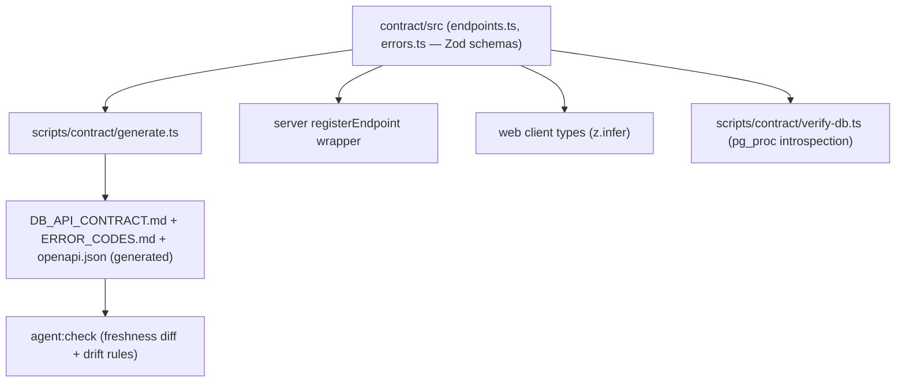

# Machine-Readable Contract with Code Generation

## Goal

Add a `contract/` workspace package to every generated app that becomes the single source of truth for the HTTP-to-procedure boundary. From it: generate `DB_API_CONTRACT.md`, `ERROR_CODES.md`, and OpenAPI; drive server routes through a typed wrapper; verify procedure signatures against the migrated database via `pg_proc` introspection.

## Architecture

## Key decisions (from prior design discussion)

- Contract is a TypeScript module with Zod schemas, not YAML — typecheckable, importable by server/web/checks, `z.infer` for types, Zod-to-JSON-Schema for OpenAPI.
- `procedure.params` is an ordered array with `source` mappings (`actor`, `query.x`, `path.x`, `body.x`) — fixes the positional-argument hazard in `callProcedure.ts`.
- Generated markdown keeps today's table-per-endpoint format with a GENERATED header; `agent:check` fails if committed artifacts are stale (regenerate-and-diff).
- Response schemas validated via `endpoint.response.parse()` only outside production (dev/test).
- Business-logic drift regexes in `check-agent-drift.ts` stay as-is; only the route/contract/error coverage checks are replaced by structural guarantees.
- Contract package stays pure (data + Zod only, no server/web imports).

## Template layout strategy

Tooling is identical everywhere and moves to [templates/shared](templates/shared) (copied on top of each variant by `generateProject.ts`). Content that differs stays per variant:

- Shared: `contract/` package scaffolding (`schema.ts`, `defineEndpoint`), `scripts/contract/generate.ts`, `scripts/contract/verify-db.ts`, updated `scripts/checks/*`.
- Per template family (base vs release-risk): `contract/src/endpoints.ts`, `contract/src/errors.ts` (release-risk adds `SERVICE_NOT_FOUND`), generated markdown files.
- Per framework (express vs fastify): `server/src/contract/registerEndpoint.ts` and rewritten route files.

## Implementation phases

### Phase 1 — Contract package and error registry
- Create `contract/` workspace: `package.json` (name `@app/contract`), `tsconfig.json`, `src/errors.ts`, `src/schema.ts` (types + `defineEndpoint`), `src/endpoints.ts`, `src/index.ts`. Add `zod` dependency.
- Add `contract` to `workspaces` in [templates/base-express/_package.json](templates/base-express/_package.json) and to `pnpm-workspace.yaml` (all four variants).
- Refactor `server/src/errors/mapDatabaseError.ts` to import the error registry instead of local `ERROR_DEFINITIONS`.
- Remove hardcoded `DOCUMENTED_ERROR_CODES` from [templates/base-express/scripts/checks/check-contract-coverage.ts](templates/base-express/scripts/checks/check-contract-coverage.ts); read the registry.

### Phase 2 — Generation pipeline and freshness check
- `scripts/contract/generate.ts`: emit `DB_API_CONTRACT.md`, `ERROR_CODES.md`, `contract/openapi.json` from the contract module. New root scripts `contract:generate` and freshness check wired into `agent:check`.
- Port `web/src/api/client.ts` types to `z.infer` imports from `@app/contract`.

### Phase 3 — Server route wrapper
- `registerEndpoint` for express and fastify: Zod input validation (strict, unknown keys rejected, failures return the standard `VALIDATION_FAILED` envelope), ordered procedure arg binding from `source` mappings, non-production response parsing.
- Rewrite `health.routes.ts`, `sample.routes.ts` (base) and `release-risk.routes.ts` on top of it.
- Retire `missing-contract-entry` and `missing-call-procedure` regex checks; replace with a check that every contract endpoint is registered.

### Phase 4 — Database introspection verifier
- `scripts/contract/verify-db.ts`: query `pg_proc` + `pg_get_function_identity_arguments` + `pg_get_functiondef` for schema `app`; verify contract procedures exist with declared param names/types/order; flag orphan procedures (allowlist for `raise_app_error`); verify raised error codes exist in the registry and in the endpoint's `errorCodes`.
- Wire in as `agent:check:db` (requires running database, keep separate from static `agent:check`) and run it inside `test:db`.

### Phase 5 — Generator-side integration
- Update [src/templateContract.ts](src/templateContract.ts): add `contract:generate`, `agent:check:db` to `REQUIRED_ROOT_SCRIPTS`; add contract files to required docs/files lists.
- Update generator tests (`copyTemplate.test.ts`, `generateProject.test.ts`, others asserting template structure).
- Update agent-facing docs in templates: `AGENTS.md` (edit contract module first, never hand-edit generated markdown), cursor prompts `006`/`007`/`008`, `README.md`, `TESTING_STRATEGY.md`.
- Extend `scripts/smoke-test.ts` to run `contract:generate` freshness and `agent:check:db` in the generated app.

## Replication across variants

All four template variants must end up consistent. Order of work: build fully in `base-express`, port to `base-fastify` (framework delta only), then to both release-risk variants (content delta: endpoints, errors, docs). Where files are identical across all four, move them to `templates/shared` instead of copying four times.

## Verification

- `npm test` (generator unit tests) after Phase 5 changes.
- Generate a scratch app for each of the four variant combinations; in each: `npm install`, `typecheck`, `agent:check`, `db:up && db:migrate && db:seed`, `test:db` (includes verify-db), `test:server`, `test:web`.
- `npm run test:smoke` for the end-to-end path.